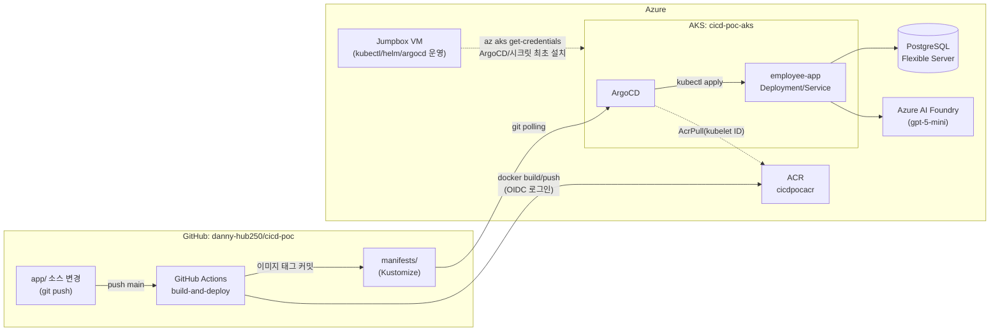
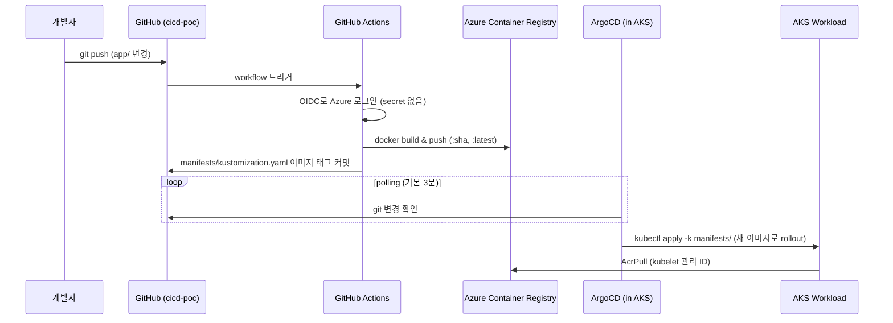

# cicd-poc

Azure(AKS + ACR) 위에서 **GitHub Actions(CI) + ArgoCD(CD)** 로 소스 변경 시 빌드/배포가
자동으로 이어지는지 검증하는 POC 레포입니다.

- 인프라(AKS/ACR/네트워크/DB 등)는 Terraform으로 구성하며, 그 소스는 이 레포가 아니라
  [`terraform-poc`](https://github.com/danny-hub250/terraform-poc) 레포의
  `Azure/environments/cicd-poc/`에 있습니다. (`Azure/environments/baxpoc-dev`를 그대로 복제한 구성)
- 이 레포(`cicd-poc`)에는 **앱 소스 + Dockerfile + GitHub Actions 워크플로 + k8s
  매니페스트(Kustomize) + ArgoCD Application + 운영 스크립트**가 들어 있습니다.

## 아키텍처



핵심 설계 포인트:

| 구성 요소 | 방식 | 이유 |
|---|---|---|
| GitHub Actions → Azure 로그인 | OIDC federated credential (secret 저장 없음) | client secret을 GitHub에 두지 않기 위함 |
| GitHub Actions 권한 | ACR에 대한 `AcrPush`만 부여 | AKS에는 직접 접근하지 않음(ArgoCD가 클러스터 내부에서 pull) |
| 배포 트리거(GitOps) | CI가 `manifests/kustomization.yaml`의 이미지 태그를 커밋 | ArgoCD가 git 변경을 감지해 자동 동기화(표준 GitOps 패턴) |
| ArgoCD 설치 | jumpbox VM에서 `scripts/argocd-install.sh` 수동 실행 | 기존 `vm-init.sh` 운영 패턴과 동일(수동 스크립트 + 문서화) |
| AKS → ACR 이미지 pull | kubelet 관리 ID에 `AcrPull` 롤 할당(Terraform) | 이미지 pull secret 관리 불필요 |

## 레포 구성

```
cicd-poc/
├── app/                        # Flask 데모 앱 (Employee 목록 + Azure Foundry 챗봇)
│   ├── app.py
│   ├── requirements.txt
│   └── Dockerfile
├── manifests/                  # ArgoCD가 감시하는 Kustomize base
│   ├── kustomization.yaml      # CI가 매 빌드마다 images.newTag를 갱신/커밋
│   ├── namespace.yaml
│   ├── deployment.yaml
│   └── service.yaml
├── argocd/
│   └── application.yaml        # ArgoCD Application CR (최초 1회만 apply)
├── db/
│   └── init.sql                # Employee 테이블 생성 + 시드 데이터
├── scripts/
│   ├── argocd-install.sh       # jumpbox: ArgoCD 설치 + Application 등록
│   └── create-app-secret.sh    # jumpbox: DB/Foundry 접속정보 k8s Secret 생성
└── .github/workflows/
    └── ci-cd.yml                # build-and-deploy 워크플로 (CI+CD 트리거)
```

## 사전 준비물

- Azure 구독 접근 권한 + `az login` 완료
- Terraform >= 1.6, Azure CLI
- 이 GitHub 레포(`danny-hub250/cicd-poc`)에 push 권한
- 인프라 소스가 있는 `terraform-poc` 레포 로컬 체크아웃

## 배포 절차

### 1. Azure 인프라 배포 (Terraform)

`terraform-poc` 레포에서:

```powershell
cd Azure/environments/cicd-poc
# vm_admin_password / db_admin_password 는 secrets.auto.tfvars 로 별도 관리 (gitignore 대상)
terraform init
terraform plan -out=tfplan
terraform apply tfplan
```

`terraform.tfvars`의 `github_repo`(기본값 `danny-hub250/cicd-poc`)와 `github_branch`(기본값 `main`)가
GitHub Actions OIDC federated credential의 subject(`repo:<repo>:ref:refs/heads/<branch>`)를 결정합니다.
fork나 다른 브랜치를 쓸 경우 반드시 값을 맞춰야 로그인이 성공합니다.

### 2. GitHub 레포 시크릿/변수 설정

`terraform output`으로 나온 값을 `cicd-poc` 레포의 **Settings → Secrets and variables → Actions**에 등록합니다.

| 이름 | 종류 | 값 (terraform output) |
|---|---|---|
| `AZURE_CLIENT_ID` | Secret | `github_actions_client_id` |
| `AZURE_TENANT_ID` | Secret | `github_actions_tenant_id` |
| `AZURE_SUBSCRIPTION_ID` | Secret | `github_actions_subscription_id` |
| `ACR_LOGIN_SERVER` | **Variable** | `acr_login_server` (예: `cicdpocacr.azurecr.io`) |

### 3. Jumpbox 초기화

`terraform output vm_public_ip`로 접속 IP 확인 후:

```bash
ssh azureuser@<vm_public_ip>
# terraform-poc 레포의 Azure/scripts/vm-init.sh 를 jumpbox로 옮겨서 실행
# (az cli, kubectl, helm, kubelogin, postgresql-client 설치 — 기존 baxpoc 환경과 동일 스크립트)
bash vm-init.sh

az login
az aks get-credentials --resource-group cicd-poc-app-rg --name cicd-poc-aks --overwrite-existing
```

### 4. DB 초기화

`cicd-poc` 레포의 `db/init.sql`을 jumpbox로 옮겨 실행:

```bash
psql "host=<postgresql_fqdn> port=5432 dbname=postgres user=psqladmin sslmode=require" -f init.sql
```

`<postgresql_fqdn>`은 `terraform output postgresql_fqdn`, 비밀번호는 `db_admin_password`(secrets.auto.tfvars)입니다.

### 5. App Secret 생성

`cicd-poc` 레포를 jumpbox에 clone(또는 scripts/ 만 복사)한 뒤:

```bash
DB_HOST=<terraform output postgresql_fqdn> \
DB_PASSWORD=<db_admin_password> \
FOUNDRY_ENDPOINT=<terraform output foundry_endpoint> \
FOUNDRY_API_KEY=<terraform output foundry_primary_access_key> \
FOUNDRY_DEPLOYMENT=<terraform output foundry_deployment_name> \
./scripts/create-app-secret.sh
```

### 6. ArgoCD 설치 + Application 등록

먼저 `manifests/kustomization.yaml`의 `<ACR_LOGIN_SERVER>` 플레이스홀더를 실제 값으로 바꿔
커밋합니다(최초 1회. 이후로는 CI가 이 파일을 계속 갱신합니다):

```bash
sed -i "s|<ACR_LOGIN_SERVER>|$(terraform output -raw acr_login_server)|" manifests/kustomization.yaml
git add manifests/kustomization.yaml && git commit -m "chore: set ACR login server" && git push
```

그 다음 jumpbox에서:

```bash
./scripts/argocd-install.sh
```

`argocd-install.sh`는 ArgoCD 설치 → `argocd-server`를 LoadBalancer로 노출 → 초기 admin 비밀번호 출력 →
`argocd/application.yaml` 등록까지 한 번에 수행합니다.

### 7. 첫 배포 트리거

`app/` 아래 아무 파일이나 수정해서 `main` 브랜치에 push (또는 Actions 탭에서 워크플로 수동 실행):

```bash
git commit --allow-empty -m "test: trigger first build"
git push
```

GitHub Actions가 이미지를 빌드해 ACR에 push하고, `manifests/kustomization.yaml`의 이미지 태그를
커밋합니다. ArgoCD는 기본 3분 polling 주기(또는 GitHub webhook 설정 시 즉시)로 이를 감지해
클러스터에 자동 반영합니다.

### 8. 동작 확인

```bash
kubectl -n cicd-poc get svc employee-app
# EXTERNAL-IP로 브라우저 접속 → Employee 목록 + Foundry 챗봇 확인
# 페이지 하단 "build: <git short sha>" 문자열로 최신 배포가 반영됐는지 확인
kubectl -n argocd get application employee-app
```

## 자동화 흐름 요약



## 트러블슈팅

- **`az acr login` / push 403** — Terraform apply 후 role assignment 전파에 수 분 걸릴 수 있음. 재시도.
- **ArgoCD Application이 `OutOfSync`에서 안 넘어감** — `manifests/kustomization.yaml`의
  `newName`에 `<ACR_LOGIN_SERVER>` 플레이스홀더가 그대로 남아있는지 확인(2단계 6번 참고).
- **Pod가 `ImagePullBackOff`** — `az aks show -g cicd-poc-app-rg -n cicd-poc-aks --query
  identityProfile` 로 kubelet identity 확인 후, ACR에 `AcrPull` 롤이 실제로 붙었는지
  `az role assignment list --scope <acr_id>`로 확인 (Terraform의 `aks_acr_pull` 리소스).
- **DB 연결 실패(`could not translate host name`)** — jumpbox와 마찬가지로 AKS는
  `cicd-poc-vnet` 안에 있어 PostgreSQL private DNS zone을 통해 해석되어야 함. `db-snet` delegation과
  `postgresql_dns_link`가 정상 생성됐는지 확인.
- **GitHub Actions `git push` 실패(403)** — 레포 `Settings → Actions → General → Workflow
  permissions`을 "Read and write permissions"로 설정해야 함(기본값은 read-only).

## 정리(삭제)

```powershell
# terraform-poc 레포에서
cd Azure/environments/cicd-poc
terraform destroy
```

GitHub 레포의 Secrets/Variables는 인프라 삭제와 별개이므로 필요 시 수동으로 정리합니다.

## 참고

- 인프라 소스: `terraform-poc` 레포 `Azure/environments/cicd-poc/` (참고 구성: `Azure/environments/baxpoc-dev/`)
- 데모 앱 원본: `terraform-poc` 레포 `Azure/scripts/employee-app/` (jumpbox에서 ad-hoc으로 만들었던 버전을
  이 레포로 옮기며 `/chat` 프론트엔드-백엔드 경로 불일치 버그를 수정하고 `/healthz`를 추가함)
