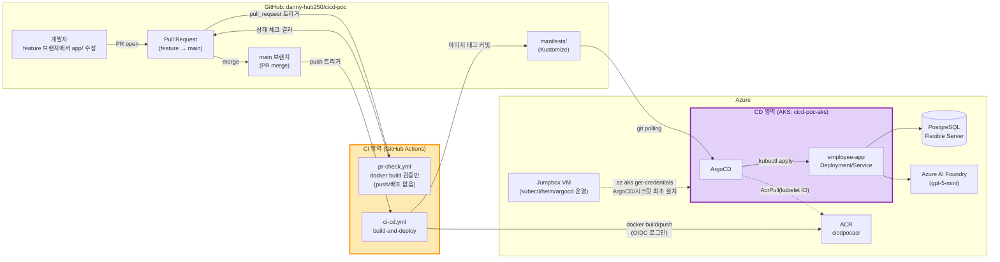
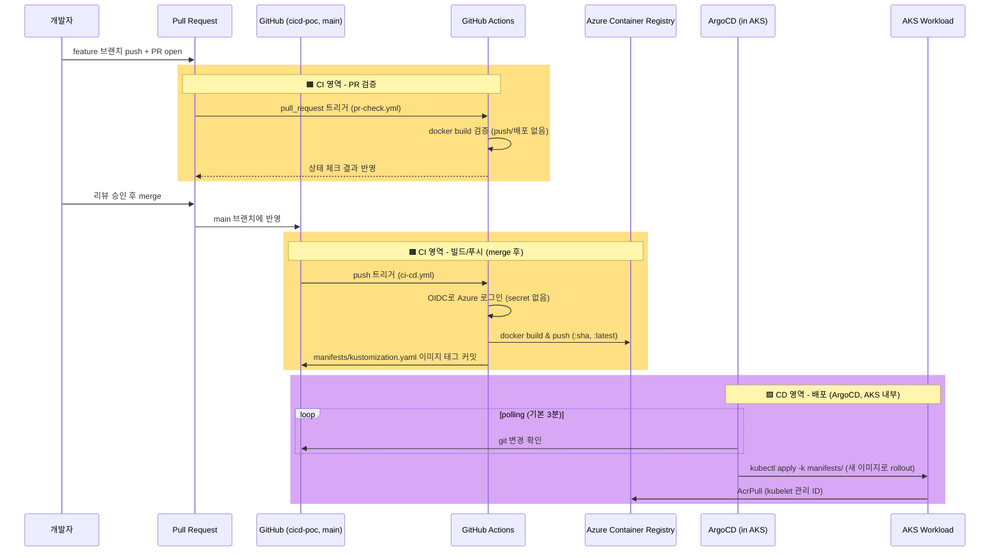

# cicd-poc

Azure(AKS + ACR) 위에서 **GitHub Actions(CI) + ArgoCD(CD)** 로 소스 변경 시 빌드/배포가
자동으로 이어지는지 검증하는 POC 레포입니다.

- 인프라(AKS/ACR/네트워크/DB 등)는 Terraform으로 구성하며, 그 소스는 이 레포가 아니라
  [`terraform-poc`](https://github.com/danny-hub250/terraform-poc) 레포의
  `Azure/environments/cicd-poc/`에 있습니다. (`Azure/environments/baxpoc-dev`를 그대로 복제한 구성)
- 이 레포(`cicd-poc`)에는 **앱 소스 + Dockerfile + GitHub Actions 워크플로 + k8s
  매니페스트(Kustomize) + ArgoCD Application + 운영 스크립트**가 들어 있습니다.

## 아키텍처



`CI 영역`은 GitHub Actions에서 이미지를 빌드/검증/push하고 매니페스트를 갱신하는 부분,
`CD 영역`은 AKS 안에서 ArgoCD가 git/ACR을 직접 보고 실제 배포를 수행하는 부분입니다.
두 영역은 git 커밋(=`manifests/`)으로만 연결되고, GitHub Actions가 AKS에 직접 접근하는
경로는 없습니다.

핵심 설계 포인트:

| 구성 요소 | 방식 | 이유 |
|---|---|---|
| PR 단계 검증 (CI) | `pull_request` 트리거 시 `pr-check.yml`이 이미지 빌드만 검증, push/배포 없음 | main에 merge되기 전에 빌드 가능 여부를 상태 체크로 확인 |
| GitHub Actions → Azure 로그인 (CI) | OIDC federated credential (secret 저장 없음) | client secret을 GitHub에 두지 않기 위함 |
| GitHub Actions 권한 (CI) | ACR에 대한 `AcrPush`만 부여 | AKS에는 직접 접근하지 않음(ArgoCD가 클러스터 내부에서 pull) |
| 배포 트리거(GitOps, CI→CD 경계) | CI가 `manifests/kustomization.yaml`의 이미지 태그를 커밋 | ArgoCD가 git 변경을 감지해 자동 동기화(표준 GitOps 패턴) |
| ArgoCD 설치 (CD) | jumpbox VM에서 `scripts/argocd-install.sh` 수동 실행 | 기존 `vm-init.sh` 운영 패턴과 동일(수동 스크립트 + 문서화) |
| AKS → ACR 이미지 pull (CD) | kubelet 관리 ID에 `AcrPull` 롤 할당(Terraform) | 이미지 pull secret 관리 불필요 |

## 레포 구성

```
cicd-poc/
├── app/                        # Flask 데모 앱 (Employee 목록 + Azure Foundry 챗봇)
│   ├── app.py
│   ├── requirements.txt
│   └── Dockerfile
├── manifests/                  # ArgoCD가 감시하는 Kustomize base
│   ├── kustomization.yaml      # CI가 매 빌드마다 images.newTag를 갱신/커밋
│   ├── namespace.yaml
│   ├── deployment.yaml
│   └── service.yaml
├── argocd/
│   └── application.yaml        # ArgoCD Application CR (최초 1회만 apply)
├── db/
│   └── init.sql                # Employee 테이블 생성 + 시드 데이터
├── scripts/
│   ├── argocd-install.sh       # jumpbox: ArgoCD 설치 + Application 등록
│   └── create-app-secret.sh    # jumpbox: DB/Foundry 접속정보 k8s Secret 생성
└── .github/workflows/
    ├── pr-check.yml             # PR 시 빌드 검증만 (push/배포 없음)
    └── ci-cd.yml                # main push 시 build-and-deploy (CD 트리거)
```

## 사전 준비물

- Azure 구독 접근 권한 + `az login` 완료
- Terraform >= 1.6, Azure CLI
- 이 GitHub 레포(`danny-hub250/cicd-poc`)에 push 권한
- 인프라 소스가 있는 `terraform-poc` 레포 로컬 체크아웃
- GitHub CLI(`gh`) — Secrets/Variables 등록에 사용 (설치법은 4단계 참고)

## 배포 절차

각 단계 앞에 실행 위치를 표시했습니다. **[로컬]**은 작업 PC(PowerShell), **[jumpbox]**는
1단계에서 만든 VM에 SSH로 접속한 뒤(bash) 실행하는 명령입니다. 인프라 소스(`Azure/environments/cicd-poc`)는
`terraform-poc` 레포에 있으므로, 1~2단계는 그 레포에서 실행합니다.

### 1. Azure 로그인 + Terraform apply — [로컬] `terraform-poc` 레포

```powershell
az login
az account set --subscription "<subscription-id>"

cd Azure/environments/cicd-poc
```

`secrets.auto.tfvars`를 최초 1회 생성합니다 (gitignore 대상, 저장소에 커밋되지 않음):

```powershell
@"
vm_admin_password = "<VM 관리자 비밀번호>"
db_admin_password = "<DB 관리자 비밀번호>"
"@ | Set-Content -Encoding UTF8 secrets.auto.tfvars
```

```powershell
terraform init
terraform plan -out=tfplan
terraform apply tfplan
```

`terraform.tfvars`의 `github_repo`(기본값 `danny-hub250/cicd-poc`)와 `github_branch`(기본값 `main`)가
GitHub Actions OIDC federated credential의 subject(`repo:<repo>:ref:refs/heads/<branch>`)를 결정합니다.
fork나 다른 브랜치를 쓸 경우 반드시 값을 맞춰야 로그인이 성공합니다.

### 2. 배포 결과 값 확인 — [로컬] 같은 디렉터리

```powershell
terraform output -raw acr_login_server
terraform output -raw github_actions_client_id
terraform output -raw github_actions_tenant_id
terraform output -raw github_actions_subscription_id
terraform output -raw vm_public_ip
terraform output -raw postgresql_fqdn
terraform output -raw foundry_endpoint
terraform output -raw foundry_deployment_name
terraform output -raw foundry_primary_access_key
```

아래 단계에서 `<...>` 자리에 여기 나온 값을 그대로 넣습니다.

### 3. 이 레포(cicd-poc) push — [로컬]

```powershell
cd "<cicd-poc 로컬 경로>"
git remote add origin https://github.com/danny-hub250/cicd-poc.git
git branch -M main
git push -u origin main
```

### 4. GitHub Secrets / Variables 등록 — [로컬] gh CLI

`gh`가 설치되어 있지 않다면 먼저 설치하고 로그인합니다 (1회만 하면 됨):

```powershell
winget install --id GitHub.cli -e
```

설치 후 **새 PowerShell 창**을 열어 PATH를 반영시킨 뒤:

```powershell
gh --version
gh auth login
```

`gh auth login` 진행 시 선택 옵션:

1. `What account do you want to log into?` → **GitHub.com**
2. `What is your preferred protocol for Git operations?` → **HTTPS**
3. `Authenticate Git with your GitHub credentials?` → **Yes**
4. `How would you like to authenticate?` → **Login with a web browser** (브라우저에 뜬 one-time code 입력)

로그인 확인:

```powershell
gh auth status
```

`Logged in to github.com as danny-hub250`가 뜨면 준비 완료입니다. 이제 Secrets/Variables를 등록합니다.

| 이름 | 종류 | 값 (terraform output) |
|---|---|---|
| `AZURE_CLIENT_ID` | Secret | `github_actions_client_id` |
| `AZURE_TENANT_ID` | Secret | `github_actions_tenant_id` |
| `AZURE_SUBSCRIPTION_ID` | Secret | `github_actions_subscription_id` |
| `ACR_LOGIN_SERVER` | **Variable** | `acr_login_server` (예: `cicdpocacr.azurecr.io`) |

```powershell
gh secret   set AZURE_CLIENT_ID       --repo danny-hub250/cicd-poc --body "<github_actions_client_id>"
gh secret   set AZURE_TENANT_ID       --repo danny-hub250/cicd-poc --body "<github_actions_tenant_id>"
gh secret   set AZURE_SUBSCRIPTION_ID --repo danny-hub250/cicd-poc --body "<github_actions_subscription_id>"
gh variable set ACR_LOGIN_SERVER      --repo danny-hub250/cicd-poc --body "<acr_login_server>"

# CI가 manifests/를 커밋-백 할 수 있도록 workflow 기본 권한을 write로 변경 (기본값은 read-only)
gh api --method PUT repos/danny-hub250/cicd-poc/actions/permissions/workflow `
  -f default_workflow_permissions=write `
  -F can_approve_pull_request_reviews=false
```

### 5. Jumpbox 접속 + 기본 초기화 — [로컬 → SSH]

```powershell
scp "<terraform-poc 로컬 경로>/Azure/scripts/vm-init.sh" azureuser@<vm_public_ip>:~/vm-init.sh
ssh azureuser@<vm_public_ip>
```

**[jumpbox]**
```bash
bash vm-init.sh
exit          # docker 그룹 반영을 위해 재접속 필요
```

```powershell
ssh azureuser@<vm_public_ip>
```

### 6. AKS 자격 증명 확보 + 이 레포 clone — [jumpbox]

```bash
az login
az aks get-credentials --resource-group cicd-poc-app-rg --name cicd-poc-aks --overwrite-existing

git clone https://github.com/danny-hub250/cicd-poc.git
cd cicd-poc
```

### 7. DB 초기화 — [jumpbox]

```bash
psql "host=<postgresql_fqdn> port=5432 dbname=postgres user=psqladmin sslmode=require" -f db/init.sql
# 프롬프트에서 db_admin_password 입력
```

### 8. App Secret 생성 — [jumpbox]

```bash
DB_HOST=<postgresql_fqdn> \
DB_PASSWORD=<db_admin_password> \
FOUNDRY_ENDPOINT=<foundry_endpoint> \
FOUNDRY_API_KEY=<foundry_primary_access_key> \
FOUNDRY_DEPLOYMENT=<foundry_deployment_name> \
./scripts/create-app-secret.sh
```

### 9. ACR 값 반영 + push — [jumpbox]

`manifests/kustomization.yaml`의 `<ACR_LOGIN_SERVER>` 플레이스홀더를 실제 값으로 바꿔 커밋합니다
(최초 1회만 수동으로 하면, 이후로는 CI가 이 파일을 계속 갱신합니다):

```bash
sed -i "s|<ACR_LOGIN_SERVER>|<acr_login_server>|" manifests/kustomization.yaml
git config user.name "DannyLee"
git config user.email "danny-hub250@users.noreply.github.com"
git add manifests/kustomization.yaml
git commit -m "chore: set ACR login server"
git push   # GitHub 인증 필요 (PAT 입력 또는 사전에 gh auth login)
```

### 10. ArgoCD 설치 + Application 등록 — [jumpbox]

```bash
./scripts/argocd-install.sh
```

`argocd-install.sh`는 ArgoCD 설치 → `argocd-server`를 LoadBalancer로 노출 → 초기 admin 비밀번호 출력 →
`argocd/application.yaml` 등록까지 한 번에 수행합니다. 출력되는 admin 비밀번호와 LoadBalancer IP를
메모해둡니다.

### 11. 첫 CI/CD 트리거 — [로컬]

```powershell
cd "<cicd-poc 로컬 경로>"
git commit --allow-empty -m "test: trigger first build"
git push
```

최초 동작 확인은 위처럼 `main`에 직접 빈 커밋을 push해도 됩니다. 이후 실제 운영에서는
**feature 브랜치 → PR → `pr-check.yml`이 빌드 검증(상태 체크) → merge**의 흐름을 권장합니다.
`main`으로 merge되는 순간 `ci-cd.yml`이 실행되어 이미지를 빌드해 ACR에 push하고,
`manifests/kustomization.yaml`의 이미지 태그를 커밋합니다(=CD 트리거). ArgoCD는 기본 3분
polling 주기(또는 GitHub webhook 설정 시 즉시)로 이 커밋을 감지해 클러스터에 자동 반영합니다.

### 12. 배포 확인 — [jumpbox]

```bash
kubectl -n cicd-poc get svc employee-app
# EXTERNAL-IP로 브라우저 접속 → Employee 목록 + Foundry 챗봇 확인
# 페이지 하단 "build: <git short sha>" 문자열로 최신 배포가 반영됐는지 확인
kubectl -n argocd get application employee-app
```

## 자동화 흐름 요약



## 트러블슈팅

- **`az acr login` / push 403** — Terraform apply 후 role assignment 전파에 수 분 걸릴 수 있음. 재시도.
- **ArgoCD Application이 `OutOfSync`에서 안 넘어감** — `manifests/kustomization.yaml`의
  `newName`에 `<ACR_LOGIN_SERVER>` 플레이스홀더가 그대로 남아있는지 확인(9단계 참고).
- **Pod가 `ImagePullBackOff`** — `az aks show -g cicd-poc-app-rg -n cicd-poc-aks --query
  identityProfile` 로 kubelet identity 확인 후, ACR에 `AcrPull` 롤이 실제로 붙었는지
  `az role assignment list --scope <acr_id>`로 확인 (Terraform의 `aks_acr_pull` 리소스).
- **DB 연결 실패(`could not translate host name`)** — jumpbox와 마찬가지로 AKS는
  `cicd-poc-vnet` 안에 있어 PostgreSQL private DNS zone을 통해 해석되어야 함. `db-snet` delegation과
  `postgresql_dns_link`가 정상 생성됐는지 확인.
- **GitHub Actions `git push` 실패(403)** — 레포 `Settings → Actions → General → Workflow
  permissions`을 "Read and write permissions"로 설정해야 함(기본값은 read-only).

## 정리(삭제)

```powershell
# terraform-poc 레포에서
cd Azure/environments/cicd-poc
terraform destroy
```

GitHub 레포의 Secrets/Variables는 인프라 삭제와 별개이므로 필요 시 수동으로 정리합니다.

## 참고

- 인프라 소스: `terraform-poc` 레포 `Azure/environments/cicd-poc/` (참고 구성: `Azure/environments/baxpoc-dev/`)
- 데모 앱 원본: `terraform-poc` 레포 `Azure/scripts/employee-app/` (jumpbox에서 ad-hoc으로 만들었던 버전을
  이 레포로 옮기며 `/chat` 프론트엔드-백엔드 경로 불일치 버그를 수정하고 `/healthz`를 추가함)
